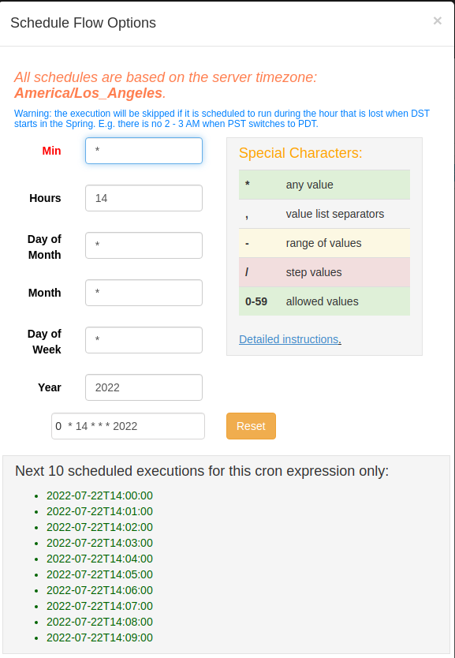

# Crypto pipeline
This project is a big data pipeline to get real-time data about cryptocurrencies and their sentiment in latest 30 tweets in the stoctwist website. This project can provide user many charts that are helpful for analysis by using PowerBi for visualization of data.
## Table of Content
[1. Instructions](#Instructions)  
[2. Pipeline](#Pipeline)
- [2.1 Data Ingestion](#DataIngestion)  
    - [2.1.1 Data source and Data description](#DataSource)  
    - [2.1.2 Data processing](#DataProcess)
- [2.2 Speed Layer](#Speed)
    - [2.2.1 Apache Spark Streaming](#Streaming)  
    - [2.2.2 PowerBI](#PowerBI1)
- [2.3 Batch layer](#Batchlayer)
    - [2.3.1 Flume](#Flume1) 
    - [2.3.2 Azkaban](#Azkaban1)
    - [2.3.3 Hadoop](#Hadoop1) 
    - [2.3.4 Apache Spark](#Spark1)  
    - [2.3.5 Cassandra](#Cassandra1) 
    - [2.3.6 PowerBI](#PowerBI2)
    
[3. How to run](#Howto)  
- [3.0 Requirements](#Requirements) 
- [3.1 Kafka](#Kafka2) 
- [3.2 Apache Spark Streaming](#Streaming2)  
- [3.3 Flume](#Flume2)  
- [3.4 Hadoop](#Hadoop2)
- [3.5 Azkaban](#Azkaban2)  
- [3.6 Cassandra](#Cassandra2)
- [3.7 Apache Spark](#Spark2)  
- [3.8 PowerBI](#PowerBi3) 

[4. Results](#Results)  


## <a name="Instructions">1. Instructions</a>
- The project give the user the visualization of the cryptocurrencies in many different timeframes such as 1 minutes, 15 minutes, 60 minutes,...  
  
- The project give the user the visualization of historical data of cryptocurrencies, user can check information of a specific cryptocurrencies in a specific time.  
  
- Users can have the sentiment of these cryptocurrencies in 30 tweets at different times. 
    
- Users can schedule data refresh of their free will  
  


## <a name="Pipeline">2. Pipeline</a>
- In this project, I use many open-source technologies like Kafka ,Apache Flume ,Apache Spark, Apache Hadoop, Azkaban, Apache Cassandra, PowerBI.  
- The pipeline is created based lamda architecture. The data will go through Kafka then Apache Spark streaming get data and stream it to PowerBI streaming dataset.  
- The second flow is that the data will go through Kafka and be saved into Hadoop HDFS file. In a scheduled time which Azkaban is setuped, Azkaban will run Apache Spark to get data from Hadoop and write it into Apache Cassandra. PowerBI will get data from Cassandra and update the visualization by using Scheduled Refresh in PowerBI app.
  


### <a name="DataIngestion">2.1 Data Ingestion</a>
>#### <a name="DataSource">2.1.1 Data source and data description </a>
>- Using the API from the website "https://twelvedata.com/" to get the cryptocurrencies data. This website provides us a freely websocket that return realtime data about cryptocurrencies. The data that is returned has many informations about a cryptocurrencies such as: symbol, time, price, bid, ask, day_volume.
>- Using the API from the website "https://stocktwits.com/" to get the tweet data. This API returns us the latest 30 tweets about a hashtag when it is called. The data that is returned has many information about a hashtag like: the body of a tweet, who tweeted it,when the tweet was created, the sentiment of a hashtag.
>#### <a name="DataProcess">2.1.2 Data processing </a>
>- In this project, I use Kafka 2.4.1 for Scala 2.11. The link to install Kafka: https://archive.apache.org/dist/kafka/2.4.1/kafka_2.11-2.4.1.tgz
>- With cryptocurrencies data, all the information is useful so the message that Kafka will send will contain all of them. Then Kafka will send this message into a topic. In the code, the topic for cryptocurrencies data is ***CryptoData***
>- With tweet data, the information is processed to get the sentiment of the tweet. The API returns json data. I convert all of it into a string. The sentiment is calculted by count ***bearish/bullish*** in the string. Then the messages contains symbol, datetime, bullish count, bearish count. The Kafka will send this messages into a topic named ***CryptoSentiment***

### <a name="Speed">2.2 Speed Layer </a>

>#### <a name="Streaming">2.2.1 Apache Spark Streaming</a>
>- Apache Spark Streaming get the data from Kafka and stream data into PowerBI streaming dataset for visualization.
>- The technique using in Apache Spark Streaming is Discretized Streams (DStreams) and in this project, I recommend using this link for integration between Kafka and Apache Spark Streaming: https://spark.apache.org/docs/2.4.0/streaming-kafka-0-8-integration.html .
>####  <a name="PowerBI1">2.2.2 PowerBI</a>
>- PowerBI is the tool used to visualize the data. In this flow, data is being pushed into PowerBI streaming dataset. In the PowerBI app, I create a dashboard. In this dashboard, I create a tile and add the streaming dataset into the tile. In this tile, I can create many chats that visualize the streaming data in the real-time. When the data is not pushed, the tile becomes empty.

###  <a name="Batchlayer">2.3 Batch layer</a>
>####  <a name="Flume1">2.3.1 Flume</a>
>- Apache Flume is a distributed, reliable software for effciently collecting, moving large amounts of log data.
>- In this project, Apache Flume will get data from Kafka when kafka is publishing data, and write that data into Hadoop HDFS file. 
>- In this project, I use Flume version 1.9.0. You can download Flume at: http://archive.apache.org/dist/flume/stable/apache-flume-1.9.0-bin.tar.gz
>- After installing Flume, make sure you add the FLUME_HOME, JAVA_HOME into your environment variables. You can do it by the command:    
    `export FLUME_HOME=/path/to/apache-flume-1.9.0-bin `  
`export PATH=$PATH:FLUME_HOME`  
`export PATH=$PATH:FLUME_HOME/bin`  
`export JAVA_HOME=/usr/lib/jvm/java-8-openjdk-amd64`  
`export PATH=$PATH:JAVA_HOME`  
`export FLUME_CLASSPATH=/path/to/apache-flume-1.9.0-bin/lib `  
>- Move the Flume lib in this git into your Flume-1.9.0 lib. This will help connect Flume with Hadoop.
>#### <a name="Azkaban1">2.3.2 Azkaban</a>
>- We use Azkaban to manage workflow of the batch layer, for detail, it is to command Spark to write Data from Hadoop to Cassandra in scheduled time. Azkaban help user to schedule when to start a job so that user can schedule one and for all. Azkaban can rerun job if the job get bugs and send email to notify about this failure.
>- In this project, Azkaban helps to autorun a spark command to get data from Hadoop to Cassandra at a scheduled time.
>- The installation of Azkaban is in their github at: https://github.com/azkaban/azkaban
>####  <a name="Hadoop1">2.3.3 Hadoop</a>
>- Hadoop is a software framework for distributed storage and processing of big data using the MapReduce programing model.
>- In this project, I use Hadoop to save the big data from Kafka.
>- In this project, I install Hadoop 2.7.0. You can downloat at link: https://archive.apache.org/dist/hadoop/common/hadoop-2.7.0/hadoop-2.7.0.tar.gz
>- I recommend follow the installation of this link: https://phoenixnap.com/kb/install-hadoop-ubuntu
>#### <a name="Spark1">2.3.4 Apache Spark</a>
>- Apache Spark is an open-source unified analytics engine for large-scale data processing. Apache Spark provides an interface for programming clusters with implicit data parallelism and fault tolerance.
>- In this flow, Apache Spark will get data from Hadoop HDFS file and convert it into DataFrame then save it into Apache Cassandra.
>- In this project, I install pyspark package instead of installing Apache Spark. The version of pyspark can be founded in requirements file.
>#### <a name="Cassandra1">2.3.5 Cassandra</a>
>- Cassandra is NoSql database management designed to handle large amounts of data across many commodity servers, providing high availability with no single point of failure.
>- In this project, I use Cassandra for storing transformed data. I use Cassandra version 3.4.0.
>- To download Cassandra 3.4.0, you can follow this link: https://archive.apache.org/dist/cassandra/3.4/apache-cassandra-3.4-bin.tar.gz
>- To install Cassandra, I recommend follow this link: https://cassandra.apache.org/doc/latest/cassandra/getting_started/installing.html
>-  You can check if Cassandra is installed successfully by using the code in a terminal:`cqlsh`
>#### <a name="PowerBI2">2.3.6 PowerBI</a>
>- I use PowerBI to get data from Cassandra and using it for visualization. PowerBI is one of the most powerful tools for analysis.
>- To get data from Cassandra, I use Cassandra ODBC Driver. You must install Cassandra ODBC Driver for the connection between Cassandra and PowerBI .The installation is in this link: https://www.cdata.com/kb/tech/cassandra-powerbi.rst
>- In the PowerBI desktop, choose **Get data** and choose **ODBC** then name the **DataSourceName(DSN)** for connection between Cassandra and PowerBI. After that, you have connected to the Cassandra database and choose your own database as your need.
>- To refresh data when using PowerBI app, you must install PowerBI Gateway in this link: https://powerbi.microsoft.com/en-us/gateway/. The PowerBI gateway helps keep data up-to-date by connecting to the data sources without the need to move data.
## <a name="Howto">3. How to run</a>
>### <a name="Requirements">3.0 Requirements</a>

>- Make sure your python version is 3.7
>- Please use conda enviroment for this project. Create conda enviroment: `conda create --name pythonspark python=3.7`
>- Install the required packages: `pip install -r requirements.txt`

>### <a name="Kafka2">3.1 Kafka</a>
>- Start Kafka enviroment by go the Kafka folder:
>    - Open a terminal and type:
    `bin/zookeeper-server-start.sh config/zookeeper.properties `
>    - Open another ternimal then type: 
    `bin/kafka-server-start.sh config/server.properties`
>- Create Kafka topic:
>    - Create cryptocurrencies topic: ` bin/kafka-topics.sh --create --topic CryptoData --bootstrap-server localhost:9092`
>    - Create tweet topic: ` bin/kafka-topics.sh --create --topic CryptoSentiment --bootstrap-server localhost:9092`  
>- Run the data ingestion:
>    - Sign up to twelve data and get a free api key.
>    - Save free api key into api_key.txt file or change the api key path in CryptoDataIngestion.py file. 
>    - Get crytocurrencies data: `python3 Crypto/Data_Ingestion/CryptoDataIngestion.py`
>    - Get tweet data :`python3 Crypto/Data_Ingestion/StocktwistDataIngestion.py`

>### <a name="Streaming2">3.2 Apache Spark Streaming</a>
>- To get PowerBI streaming dataset url, you need to login to PowerBi, get to **Workspace** then choose **New** and choose **Streaming Dataset** then name dataset and add value name like this and then choose **Create**:
>- Create 2 streaming dataset like below, one for BTC data, one for ETH data:
>```
>    symbol : Text
>    currency_base: Text
>    time: DateTime
>    price: Number
>    bid: Number
>    ask: Number
>    day_volume: Number
>    year: Number
>    month: Number
>    day: Number
>    hour: Number
>    min: Number
>    sec: Number
>```
>- Save the urls of streaming dataset into files. We will need to post data to these urls to have real-time data.
>- Navigate Crypto/Hot_Data/ directory:
>    - Change the url of streaming dataset into file APIETH.txt and file apiPowerBI.txt. File APIETH includes api for ETH streaming dataset and file apiPowerBI.txt includes api for BTC streaming dataset
>    - Start stream data to PowerBI: `spark-submit --packages org.apache.spark:spark-streaming-kafka-0-8_2.11:2.4.6,com.datastax.spark:spark-cassandra-connector_2.11:2.4.3  --executor-memory 10G  --driver-memory 10G StreamingToPowerBI.py`
>- In the PowerBi app, choose **Workspace** and choose **New** and choose **New Dashboard**. In the dashboard, choose **Edit**, then  **Add a tile**, then **Custom Streaming Dataset**. Then you can choose any charts to visualize the realtime data.

>### <a name="Flume2">3.3 Flume</a>
>- Write crypto data from Kafka into Hadoop: `bin/flume-ng agent -c conf -f Crypto/Cold_Data/Flume/CryptoData.template -Dflume.root.logger=DEBUG,console -n flume1`
>- Write tweet data from Kafka into Hadoop: `bin/flume-ng agent -c conf -f Crypto/Cold_Data/Flume/StockTwits.template -Dflume.root.logger=DEBUG,console -n flume1`

>### <a name="Hadoop2">3.4 Hadoop</a>
>- Start Hadoop NameNode using code: 
>    - Go to the Hadoop/sbin directory and run: `./start-dfs.sh`
>- Make crypto and tweet storage directory in Hadoop:
>    - For crypto data,go to the Hadoop/bin directory and run: `./hadoop fs -mkdir /CrytoData`
>    - For tweet data, go to the Hadoop/bin directory and run:`./hadoop fs -mkdir /StockTwist`
>- Go to the localhost:9870 and choose **Browse for system** and check if the directory has been created.

>###  <a name="Azkaban2">3.5 Azkaban</a>
>- Run the code below to start Azkaban:
>    - Go to the Azkaban folder: `cd azkaban-solo-server/build/install/azkaban-solo-server`
>    - Start Azkaban solo server: `./bin/start-solo.sh`
>- In the Crypto/Cold_Data/Azkaban/SparkCryptoJob/ directory, change the **pythonspark** in **conda activate pythonspark** into your conda enviroment's name.
>- Zip the  SparkCryptoJob.job  and CrypdoData.sh file and name it CryptoJob.zip. The same comes with SparkTweetJob.
>- Navigate the web and open the website: **localhost:8081**. Login with **password** and **username** is **azkaban**
>- Choose **Create project** and upload a project. Upload **CryptoJob.zip** file in **Crypto/Cold_Data/Azkaban/SparkCryptoJob/** directory and **TweetJob.zip** in **Crypto/Cold_Data/Azkaban/SparkTweetJob/** directory.
>- You choose **Run Job** to run the project. If you want to schedule project, i would like you to read Azkaban's documentation for details. The Azkaban's documentation link is: "https://azkaban.readthedocs.io/en/latest/getStarted.html"

>###  <a name="Cassandra2">3.6 Cassandra</a>
>- Create a Cassandra working space for  crypto data:`cqlsh -f "Crypto/Cold_Data/Cassandra/CryptoData.cql"`
>- Create a Cassandra working space for tweet data:`cqlsh -f "Crypto/Cold_Data/Cassandra/Sentimentdata.cql"`
>- For testing: `cqlsh` & `SELECT * from cryptodata.streaming;`
>- 

>###  <a name="Spark2">3.7 Apache Spark</a>
>-  Write crypto currency data from Hadoop into Cassandra:  `spark-submit --packages org.apache.spark:spark-streaming-kafka-0-8_2.11:2.4.6,com.datastax.spark:spark-cassandra-connector_2.11:2.4.3  --executor-memory 10G  --driver-memory 10G Crypto/Cold_Data/Spark/Spark.py`
>- Write tweet data from Hadoop into Cassandra:  `spark-submit --packages org.apache.spark:spark-streaming-kafka-0-8_2.11:2.4.6,com.datastax.spark:spark-cassandra-connector_2.11:2.4.3  --executor-memory 10G  --driver-memory 10G Crypto/Cold_Data/Spark/SparkSentiment.py`

>### <a name="PowerBi3">3.8 PowerBI</a>
>- In the PowerBI Desktop, I choose **Get data** and choose **ODBC**, then choose **Data Source Name(DSN)**. 
>- In my project, I chose line chart for my visualization. You can choose many different visualizations like: bridge chart, Treemap, Matrix,... to visualize data.

## <a name="Results">4. Results</a>
- Below is a sample result of this project, I visualize how the volality of BTC/USD, ETH/BTC in 5-min timeframes, the sentiment of 2 cryptocoin in a specific time and how these coin's price changes over time. Thank you for reading.


